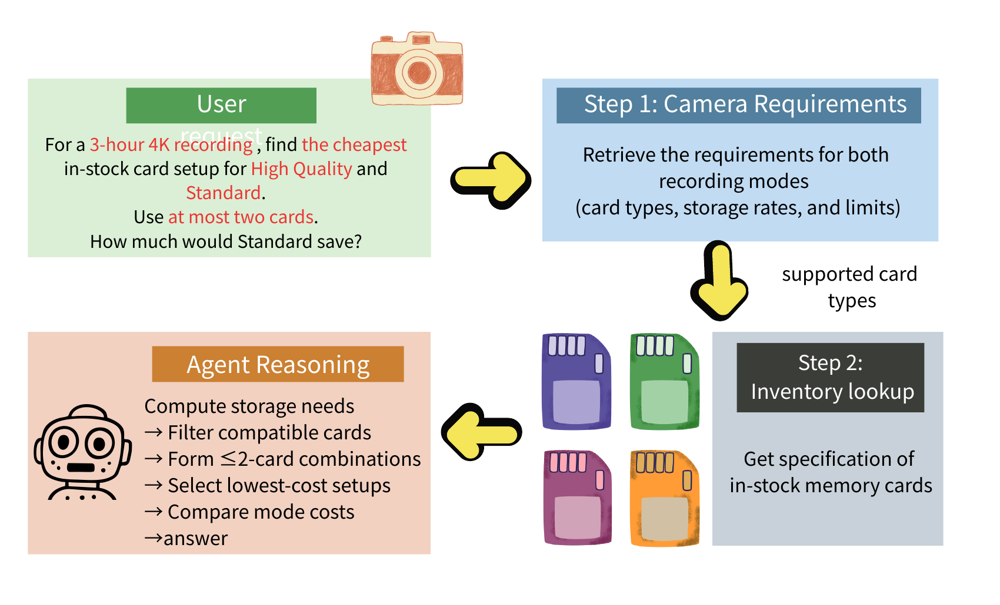

# SpokenWait

SpokenWait is a benchmark for a neglected part of real-time voice interaction: what an agent says - or fails to say - while an external tool is still running. It contains 100 human-reviewed tasks across ten everyday service domains, split evenly between one-step workflows and causally dependent two-step workflows.



## Run it

The offline path has no dependencies, credentials, or network calls. Python 3.10+ is sufficient.

```bash
git clone https://github.com/CuteOwOwO/SpokenWait.git
cd SpokenWait
python3 -m spokenwait validate
python3 -m spokenwait demo
```

The demo replays the paper's memory-card task with virtual 3-second tool delays and writes a trace plus scored metrics to `outputs/demo/`. Run `python3 -m unittest discover -s tests -v` for the complete test suite. An optional editable install exposes the same CLI as `spokenwait`:

```bash
python3 -m pip install -e .
spokenwait show product_inventory_2step_camera_mode_savings_004
```

## What is included

```text
data/tasks/          frozen paper-v1 tasks (100)
spokenwait/          dependency-free validator, demo, and temporal scorer
judge/               frozen judge policy, output schema, and 100 answer specs
docs/                task format and evaluation protocol
assets/              paper task figure
```

The ten domains are airline travel, appointment services, calendar management, pharmacy refills, product inventory, restaurant arrival, retail orders, subscription billing, ticketing, and weather. Every domain contains five one-step and five two-step tasks.

## Paper setup

Five audio-input/audio-output agents were evaluated on all 100 tasks at 3, 5, 8, and 12 second per-tool delays, with three trials per cell. The metrics are initial response latency, stage-level speech coverage, maximum silence, final-result-to-answer latency, premature hallucination, and final-answer correctness. See [the protocol](docs/PROTOCOL.md) for the exact semantic-stage rule.

### Native waiting: temporal responsiveness

Task-macro means from the paper. Coverage is descriptive, not a quality score.

| Stage | Model | Initial (s) | Coverage (%) | Max silence (s) | Result-to-answer (s) |
|---|---|---:|---:|---:|---:|
| 1-step S1 | Gemini 2.5 Live | 6.19 | 27.6 | 10.53 | 8.85 |
| 1-step S1 | Gemini 3.8 | 9.47 | 1.2 | 10.08 | **1.72** |
| 1-step S1 | Gemini 3.8 Think (Low) | **1.07** | 20.1 | 11.47 | 4.31 |
| 1-step S1 | GPT-Realtime 2.1 | 1.10 | 43.3 | 6.20 | 2.46 |
| 1-step S1 | GPT-Realtime 2.1 Mini | 1.28 | 50.3 | **6.00** | 5.05 |
| 2-step S1 | Gemini 2.5 Live | 6.07 | 23.5 | 8.69 | - |
| 2-step S1 | Gemini 3.8 | 17.15 | 0.0 | 8.50 | - |
| 2-step S1 | Gemini 3.8 Think (Low) | 1.13 | 22.9 | 8.06 | - |
| 2-step S1 | GPT-Realtime 2.1 | **1.07** | 53.0 | 4.42 | - |
| 2-step S1 | GPT-Realtime 2.1 Mini | 1.08 | 54.0 | **4.08** | - |
| 2-step S2 | Gemini 2.5 Live | - | 46.9 | **7.19** | 6.62 |
| 2-step S2 | Gemini 3.8 | - | 2.9 | 9.25 | **1.93** |
| 2-step S2 | Gemini 3.8 Think (Low) | - | 13.6 | 11.28 | 8.00 |
| 2-step S2 | GPT-Realtime 2.1 | - | 14.6 | 9.10 | 2.70 |
| 2-step S2 | GPT-Realtime 2.1 Mini | - | 49.4 | 7.79 | 11.68 |

### Native waiting: correctness

| Metric | Gemini 2.5 Live | Gemini 3.8 | Gemini 3.8 Think (Low) | GPT-RT 2.1 | GPT-RT 2.1 Mini |
|---|---:|---:|---:|---:|---:|
| Answer accuracy (%) | 79.3 | 97.3 | **98.3** | 95.5 | 56.2 |
| Premature hallucination (%) | 3.5 | **0.0** | **0.0** | **0.0** | **0.0** |

## Integrating an agent

Use each task's public tool schemas, hold its deterministic result until the configured delay expires, and record audible speech intervals, tool-call/result timestamps, and transcript segments on one monotonic clock. Convert the semantic judge's segment annotations to timestamps, then run:

```bash
python3 -m spokenwait score your_trace.json --output metrics.json
```

The repository does not ship provider-specific live-API adapters, prerecorded user audio, commercial-model outputs, or API credentials. Provider APIs and preview model identifiers change, so exact historical audio runs require the original services and are not guaranteed to remain reproducible. The frozen tasks, deterministic tool environment, evaluator contract, offline replay, and metric computation are public and reproducible.

## Citation

```bibtex
@misc{zheng2026spokenwait,
  title  = {SpokenWait: A Benchmark for Real-Time Voice Agents Awaiting Tool Results},
  author = {Bo-Xuan Zheng and Yu-Kai Guo and Ho-Lam Chung and Hung-yi Lee},
  year   = {2026}
}
```

Released under the [MIT License](LICENSE). If you modify frozen tasks, publish them under a new version instead of silently replacing paper-v1.
